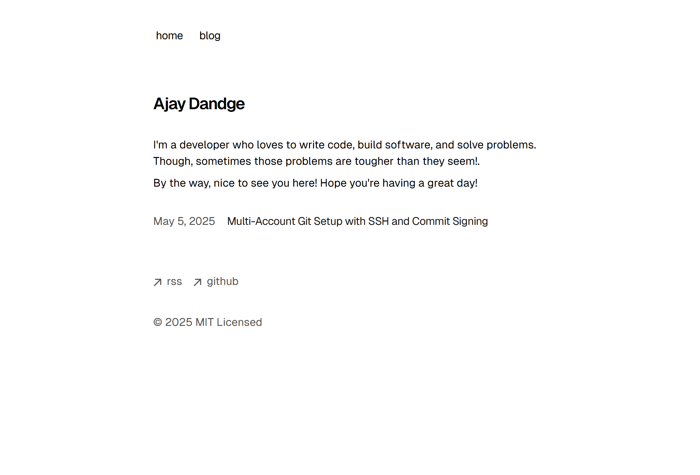

  <a href="https://ajaydandge.dev">ajaydandge.dev</a>
   
   
  <picture>
    <source media="(prefers-color-scheme: dark)" srcset="./screenshots/light.png">
    <source media="(prefers-color-scheme: light)" srcset="./screenshots/dark.png">
    
  </picture>

> [!NOTE]  
> This is adapted from [Vercel's Portfolio Blog Starter Template](https://github.com/vercel/examples/tree/main/solutions/blog) with several customizations, including:
>
> - Replacing `sugar-high` with `highlight.js` for code syntax highlighting
> - Using `satori` for prerendering OG images
> - Static site generation for deployment to GitHub Pages
> - Retro pet (Oneko or Oinu) that chases the cursor across the screen
  - Pet animations and logic adapted from [oneko.js](https://github.com/adryd325/oneko.js) and dog sprites sourced from [spicetify-oneko](https://github.com/kyrie25/spicetify-oneko)
